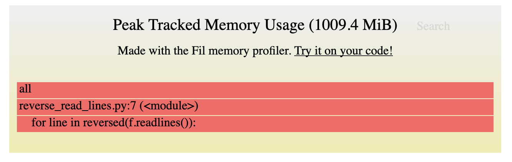
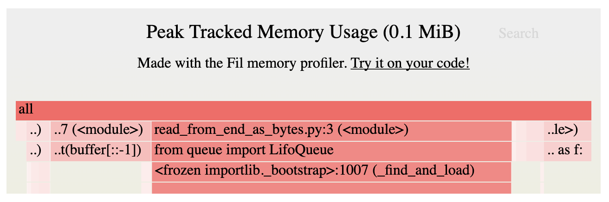
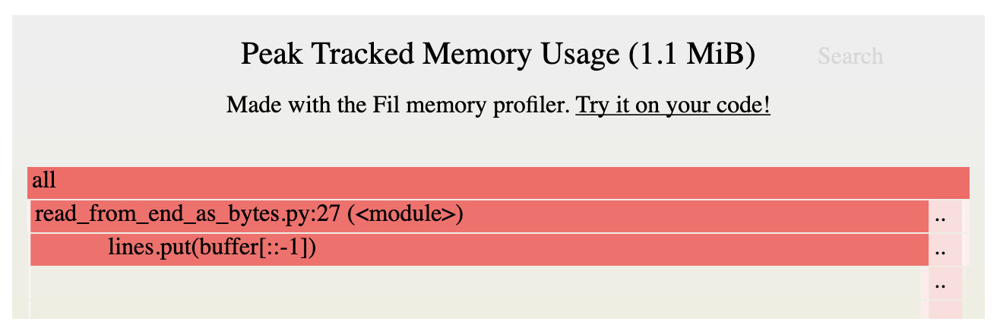

# tail

Упрощенная версия утилиты `tail`, которая поддерживает только один флаг `-f` и только один файл на вход.

## Исследование

Посмотрим на мануал к утилите `tail`:

> tail -- display the last part of a file

> The tail utility displays the contents of file or, by default, its standard input, to the standard output.

`tail` выводит последную часть файла (или стандартного ввода) в стандартный вывод.

> The display begins at a byte, line or 512-byte block location in the input.  Numbers having a leading plus (`+`) sign are relative
to the beginning of the input, for example, `-c +2` starts the display at the second byte of the input.  Numbers having a lead-
ing minus (`-`) sign or no explicit sign are relative to the end of the input, for example, `-n 2` displays the last two lines
of the input.  The default starting location is `-n 10`, or the last 10 lines of the input.

Здесь важно, что по умолчанию `tail` выводит последние 10 строк файла. Поскольку мы не поддерживаем флаг `-n`, то тоже будем выводить последние 10 строк.

> The `-f` option causes tail to not stop when end of file is reached, but rather to wait for additional data to be appended
to the input. The `-f` option is ignored if the standard input is a pipe, but not if it is a FIFO.

Флаг `-f` не останавливает утилиту после вывода последних строк, а позволяет ждать добавления новых с конца.

## Требования

Необходимо разработать аналог утилиты `tail`, которая поддерживает два режима работы:

- Без флага: вывод в стандартный вывод (`stdout`) последних 10 строк файла, название которого передано в качестве первого (и единственного) аргумента.
- С флагом `-f`: аналогично пункту «баз флага», но программа не завершает работу, а ждет добавления новых строк в конец файла и выводит их по мере добавления.

## Подходы к реализации

### Тестовый файл

Для дальнейшего исследования особенностей утилиты и подходов к её возможной реализации, сгенерируем файл (`dataset.txt`).

```python
import random
import string

from tqdm import tqdm

OUTPUT_FILE_NAME = 'dataset.txt'
LINES_COUNT = 1_000_000
CHARS_IN_LINE_COUNT = 1_000

with open(OUTPUT_FILE_NAME, 'w') as f:
    for _ in tqdm(range(LINES_COUNT)):
        for _ in range(CHARS_IN_LINE_COUNT):
            f.write(random.choice(string.hexdigits))
        f.write('\n')
```

Файл состоит из миллиона строк, в каждой из которых по тысяче символов из множества `0123456789abcdefABCDEF`.

```bash
$ du -m dataset.txt
961	dataset.txt
```

Получили файл размером 961 Мб.

### Работа без флагов

#### 1. Наивный подход

Первым решением для реализации действия без флага будет использование функции `reversed` и метода `readlines`.

```python
import sys

FILE_NAME = "dataset.txt"
LINES_TO_READ_COUNT = 10

with open(FILE_NAME, "r") as f:
    lines_read = 0
    for line in reversed(f.readlines()):
        sys.stdout.write(line)
        lines_read += 1
        if lines_read == LINES_TO_READ_COUNT:
            break
```

У этого решения есть существенный недостаток — чтобы прочитать последние 10 строк файла, необходимо загрузить весь файл в оперативную память. Проверим это на нашем файле `dataset.txt` с помощью [`filprofiler`](https://github.com/pythonspeed/filprofiler).



С помощью такой реализации мы не сможем прочитать файлы, размер которых превышает размер оперативной памяти.

#### 2. Подход с побайтовым чтением с конца файла

Будем читать файл по байтам начиная с конца и складывать байты в буффер. Как только встретим байт, значение которого является окончанием строки, зафиксируем текущее значение буффера, положив его в стэк. Сбросим буфер.

```python
import os
import sys
from queue import LifoQueue

FILE_NAME = "dataset.txt"
LINES_TO_READ_COUNT = 10

with open(FILE_NAME, "rb") as f:
    f.seek(0, os.SEEK_END)

    # Init temporary buffer for individual bytes.
    buffer = bytearray()
    # Init stack to store lines.
    lines = LifoQueue()

    current_position = f.tell()
    # Keep reading the file until the start of the file is reached
    # or required number of lines read.
    while current_position >= 0 and lines.qsize() <= LINES_TO_READ_COUNT:
        f.seek(current_position)

        byte = f.read(1)
        if byte == os.linesep.encode():
            # If current byte is a line separator then fixate the contents of
            # the buffer as a line and reset the buffer.
            # Since we read from the end we need to reverse.
            lines.put(buffer[::-1])
            buffer = bytearray()
        else:
            # Else just append the byte to the buffer.
            buffer.extend(byte)

        current_position -= 1

    # Process the very first line of the file if needed.
    # Since it does not end (start) from the line separator it won't be
    # fixated in the above `while`.
    if buffer:
        lines.put(buffer[::-1])

    # Output collected lines decoded from bytes to string.
    first = True
    while not lines.empty():
        if not first:
            sys.stdout.write(os.linesep)
        first = False

        line = lines.get().decode()
        sys.stdout.write(line)
```

Такое решение потребляет минимальное количество оперативной памяти, благодоря чему возможно читать файлы, размер которых превышает размер оперативной памяти.



Тем не менее, строки все же сохраняются в памяти, а не выводятся сразу после их прочтения. Соотвественно, количество потребляемой памяти будет зависисеть от количества строк, которое хотим прочитать.

При 1000 строк, потребление памяти увеличивается.



Второй подход более эффективен по использованию памяти. Используем его.

### Работа с флагом `-f`

#### 1. Наивный подход

«Встанем» в конец файла и будет читать строки в бесконечном цикле.

```python
import os
import sys

FILE_NAME = "dataset.txt"
LINES_TO_READ_COUNT = 10

with open(FILE_NAME, "r") as f:
    f.seek(0, os.SEEK_END)
    while True:
        line = f.readline()
        sys.stdout.write(line)
```

Такое решение работает, но полностью загружает процессор, не позволяя выполнять другие процессы.

```
PID    COMMAND      %CPU
12178  python3.9    100.0
```

#### 2. Подход с использованием `time.sleep`

Аналогично предыдущему подходу, но при получении пустой строки, мы вызываем `time.sleep`, чтобы приостановить использование процессора.

Такой подход позволяет нагружать процессор только при необходимости (если получаем непустые строки).

```python
import os
import sys
import time

FILE_NAME = "dataset.txt"
LINES_TO_READ_COUNT = 10
SLEEP_DELAY = 0.5

with open(FILE_NAME, "r") as f:
    f.seek(0, os.SEEK_END)
    while True:
        line = f.readline()
        if not line:
            time.sleep(SLEEP_DELAY)
        sys.stdout.write(line)
```

## Использование

Создайте и активируйте виртуальное окружение:

```bash
python -m venv env
source env/bin/activiate
```

Установите зависимости:

```bash
pip install -r requirements.txt
```

Запустите утилиту:

```bash
python tail.py
```

```
Usage: tail.py [OPTIONS] FILE_NAME
Try 'tail.py --help' for help.

Error: Missing argument 'FILE_NAME'.
```

*Примечание*. Флаг `--help` работает.

Передайте название файла (например, из `samples`):

```bash
python tail.py samples/titanic_5_lines.csv
```

Пример использования вместе с [`csvkit`](https://csvkit.readthedocs.io/en/latest/).

```bash
python tail.py samples/titanic_5_lines.csv | csvcut -c PassengerId,Survived | csvlook
```

```
| PassengerId | Survived |
| ----------- | -------- |
|           1 |    False |
|           2 |     True |
|           3 |     True |
|           4 |     True |
```

Использование с флагом `-f`:

```bash
python tail.py -f samples/titanic_5_lines.csv
```
